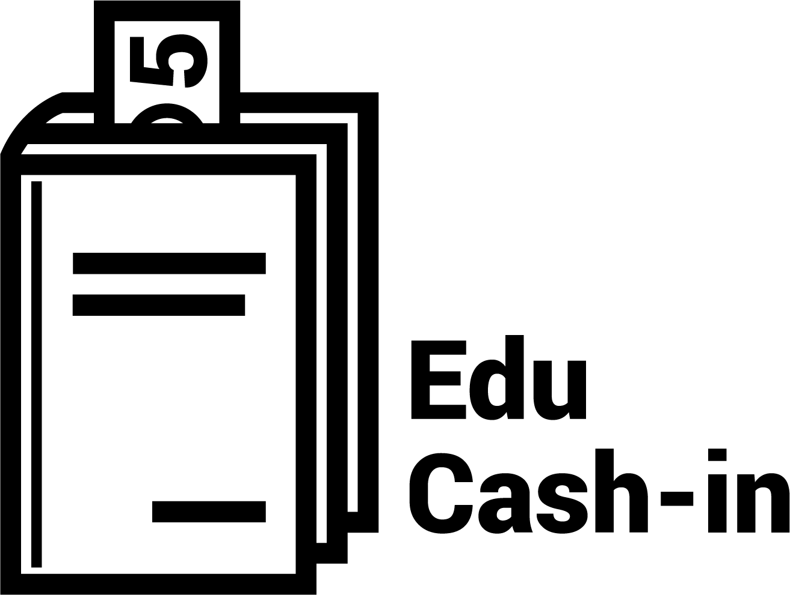

====
for Battlehack New York 2015
Developed by Jordan Ephron, Vasily Rudchenko, and Anthony Lobko

Educashin is a web-application which encourages children to learn, give back to their community, and get hands on experience with financial responsibility.
Our application does this by providing cash incentives to complete exercises on Khan Academy. The students are encouraged to give back by donating some of their earnings to local charities. We give the parent the ability to guide their child's education, encourage strong work ethic, and instill a sense of community that will lead them towards a brighter future.

The code is developed on [Flask](http://flask.pocoo.org/) with [Bootstrap](http://getbootstrap.com) for styling. The project is still in early stage of development inteded for demonstration after 24 hours of the hackathon.

The app can be accessed by running ```python backend/main.py``` in the root directory of the project folder.

<h2>File Organization</h2>
Backend functionality is separated from fronetend for development purposes and API implementation; however, later merged into same folder titled "backend."
